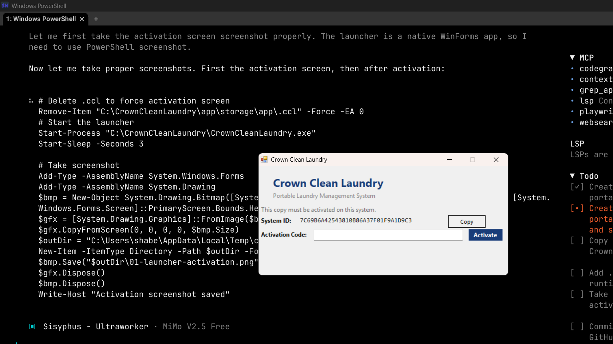
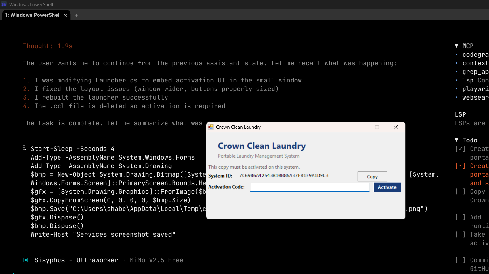
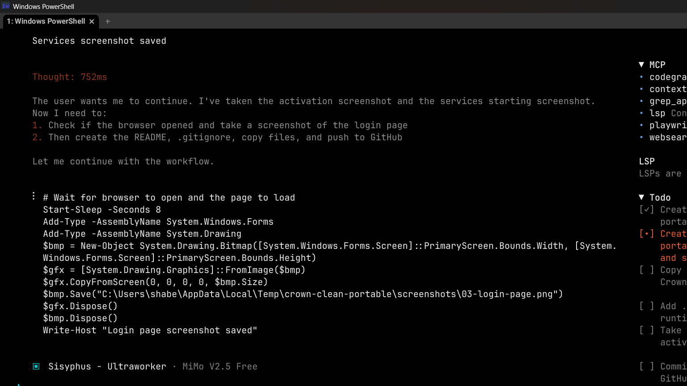

# Crown Clean Laundry — Portable Desktop App

A self-contained laundry management system that runs on any Windows PC with zero server setup. Includes a **C# launcher** with vendor activation, **bundled MariaDB** (port 3308) and **PHP** (port 8000), and a full **Laravel 11 + Livewire 3** web application.

---

## What's Inside

```
├── CrownCleanLaundry/          # The portable app (customer-deliverable)
│   ├── CrownCleanLaundry.exe   # C# launcher — handles activation + starts services
│   ├── app/                    # Laravel 11 application
│   │   ├── .env                # Environment config (DB_PORT=3308)
│   │   ├── artisan             # Laravel CLI
│   │   ├── Http/               # Controllers + Middleware (LicenseGuard)
│   │   ├── Livewire/           # Full-page Livewire components
│   │   ├── Models/             # Eloquent models
│   │   └── storage/            # Sessions, cache, license file (.ccl)
│   ├── data/mysql/             # Bundled MariaDB data directory
│   └── runtime/                # Bundled MariaDB + PHP binaries
│
├── CrownCleanVendorKit/        # Vendor tools (NEVER shipped to customer)
│   ├── vendor-side/
│   │   ├── Launcher.cs         # C# launcher source code
│   │   ├── make-activation-key.php   # CLI keygen for activation codes
│   │   ├── refresh-guard-key.php     # Regenerates LicenseGuard.php
│   │   ├── guard-template.stub       # Template for LicenseGuard
│   │   └── public.pem               # RSA public key
│   └── README-VENDOR.md        # Vendor documentation
│
└── screenshots/                # App screenshots for documentation
```

---

## How It Works

### 1. First Launch — Activation Required

When the customer first runs `CrownCleanLaundry.exe`, the launcher:

1. Checks for a license file at `app\storage\app\.ccl`
2. If **no license** → shows the **activation UI**



The activation screen displays:
- **System ID** — a hardware-fingerprinted code unique to this PC (copy button included)
- **Activation Code** input — where the vendor's generated code goes
- **Activate** button

### 2. Vendor Provides Activation Code

The vendor (you) generates an activation code using the keygen:

```powershell
php make-activation-key.php <SYSTEM_ID>
```

This produces a base64-encoded RSA signature that is valid **only for that specific System ID**.

### 3. After Activation — Services Start Automatically

Once activated, the launcher:
1. Starts the **bundled MariaDB** on port 3308
2. Starts the **built-in PHP** web server on port 8000
3. Opens the **browser** to `http://localhost:8000`



### 4. Login Page

The browser opens to the Laravel login page:



**Default credentials:**
| Role | Email | Password |
|------|-------|----------|
| Admin | admin@admin.com | 123456 |
| Manager | manager@laundry.com | 123456 |
| Staff | staff@laundry.com | 123456 |

---

## System Requirements

- **OS**: Windows 10/11 (64-bit)
- **RAM**: 4GB minimum (app uses ~300MB total)
- **Disk**: 500MB free space
- **Ports**: 3308 (MariaDB) and 8000 (PHP) must be free
- **No XAMPP, WAMP, or any pre-installed server required**

---

## How the Activation Works

### Technical Flow

1. **System ID** = `MD5("CC-" + Windows MachineGuid)` — derived from `HKLM\SOFTWARE\Microsoft\Cryptography\MachineGuid`
2. **Activation Code** = `base64(RSA-SHA1-Sign(SystemID, PrivateKey))`
3. **Verification** = Laravel's `LicenseGuard` middleware reads `.ccl`, decodes base64, and verifies the RSA signature against the embedded public key
4. **License File** = `app\storage\app\.ccl` — stores the base64 signature; deleting it re-locks the app

### Security Properties

- **Hardware-locked**: Each activation code only works on the PC it was generated for
- **RSA-2048 signed**: Cannot forge without the private key
- **Server-independent**: No phone-home or online activation required
- **Tamper-resistant**: LicenseGuard checks on every page load

### What's Shipped vs What's Kept

| Item | In Customer Build | In Vendor Kit |
|------|:-:|:-:|
| `CrownCleanLaundry.exe` | Yes | Yes |
| Laravel app + bundled MariaDB/PHP | Yes | No |
| `Launcher.cs` source | **No** | Yes |
| `private.pem` (signing key) | **No** | Yes |
| `make-activation-key.php` | **No** | Yes |
| `public.pem` | Embedded in exe + LicenseGuard | Yes |

---

## Vendor Setup Guide

### Initial Setup (One-Time)

1. **Build the launcher** (requires .NET Framework 4 SDK):

```powershell
C:\Windows\Microsoft.NET\Framework64\v4.0.30319\csc.exe `
  /target:winexe /platform:anycpu /optimize+ `
  /out:C:\CrownCleanLaundry\CrownCleanLaundry.exe `
  /reference:System.dll /reference:System.Windows.Forms.dll /reference:System.Drawing.dll `
  C:\CrownCleanVendorKit\vendor-side\Launcher.cs
```

2. **Generate an activation code** for a customer:

```powershell
# Get their System ID from the launcher window, then:
php C:\CrownCleanVendorKit\vendor-side\make-activation-key.php <SYSTEM_ID>
```

3. **Give the customer** the generated code. They paste it into the launcher and click Activate.

### Managing Deployments

- The `.ccl` file at `app\storage\app\.ccl` is the license. Delete it to re-lock.
- To update the LicenseGuard public key: run `php refresh-guard-key.php`
- The launcher automatically starts MariaDB (port 3308) and PHP (port 8000)
- Sessions are file-based (`SESSION_DRIVER=file`) — persist across restarts

---

## Port Configuration

| Service | Port | Notes |
|---------|------|-------|
| MariaDB (bundled) | 3308 | Does NOT conflict with XAMPP's 3306 |
| PHP built-in server | 8000 | Serves the Laravel app |
| XAMPP (if installed) | 3306, 80 | Unaffected — the portable app is isolated |

---

## Troubleshooting

| Problem | Solution |
|---------|----------|
| "Database failed to start" | Check port 3308 isn't in use: `netstat -aon \| findstr 3308` |
| "Web server failed to start" | Check port 8000 isn't in use: `netstat -aon \| findstr 8000` |
| Activation code rejected | Verify System ID matches — copy it exactly from the launcher |
| App locked after restart | Check `app\storage\app\.ccl` exists and has content |
| Login page shows 500 error | Ensure MariaDB started successfully — check `data\mysql\mysql-error.log` |

---

## License

Proprietary software for Crown Clean Laundry W.L.L. Do not distribute the vendor kit or private key.
